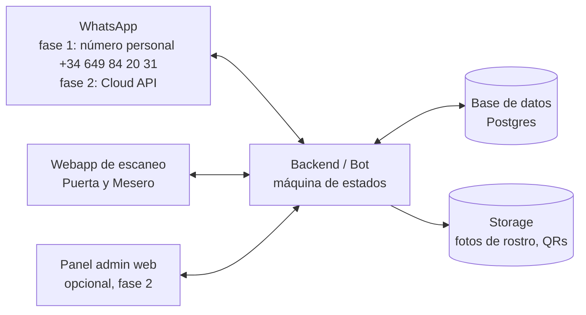

# Arquitectura técnica

## Vista general

> **Sin pasarela de pago.** El cobro es presencial en el local con el datáfono
> propio del bar (tarjeta al momento). El sistema **no procesa dinero**: el
> mesero escanea el QR, registra la comanda con su importe y marca "cobrado".
> Eso basta para los reportes de consumo por socio/invitado.

### Piezas

1. **Canal WhatsApp** — un solo número del sistema; el rol de cada persona se
   resuelve por su número de teléfono, así la misma conversación muestra menús
   distintos según el perfil.

   **Fase provisional — número personal (+34 649 84 20 31):**
   - Un número personal no puede conectarse a la API oficial de Meta sin
     convertirse en cuenta de negocio (y dejar de funcionar en la app normal).
   - Para prototipar se usa **Baileys** o **whatsapp-web.js**: librerías que
     vinculan el número como un "WhatsApp Web" más (se escanea un QR de
     vinculación una vez) y permiten al bot leer y enviar mensajes, fotos y QRs.
   - ⚠️ Limitaciones a asumir en esta fase: no es la API oficial (riesgo de
     bloqueo del número si Meta detecta spam — con volumen bajo y contactos
     que responden, el riesgo es pequeño), no hay botones interactivos (los
     menús se hacen con texto numerado: "1️⃣ Invitar 2️⃣ Reporte 3️⃣ Cancelar"),
     y el servidor debe mantener la sesión vinculada.
   - El código se estructura con una capa `WhatsAppProvider` para que el paso
     a la Cloud API oficial sea cambiar un adaptador, no reescribir los flujos.

   **Fase producción — WhatsApp Business Cloud API (Meta):**
   - Número dedicado del negocio, mensajes con botones y listas nativas,
     plantillas aprobadas, sin riesgo de bloqueo.

2. **Backend (bot + API)** — Node.js/TypeScript o Python.
   - Webhook de WhatsApp + **máquina de estados por conversación** (cada chat
     es un flujo: invitando, registrando, reportando...).
   - Genera QRs: token **JWT firmado y con versión** (revocable), no el
     teléfono en claro. Escanear un QR viejo tras una cancelación → inválido.
   - Reglas de negocio: restricciones de día/monto/personas/categorías.

3. **Base de datos (Postgres)** — entidades principales:
   - `usuarios` (teléfono, nombre, rol, estado, foto)
   - `invitaciones` (socio → invitado, restricciones, vigencia, estado)
   - `checkins` (invitado, puerta, hora, acompañantes)
   - `ordenes` / `orden_items` (mesero, invitado, productos, total, método de pago)
   - `productos` (catálogo del admin: nombre, precio, categoría)
   - `eventos` (opcional: fechas/aforos por evento)

4. **Webapp de escaneo (Puerta y Mesero)** — PWA que abre la cámara desde el
   navegador del teléfono; sin app nativa que instalar.
   - Puerta: escanear → foto + semáforo + acompañantes → check-in.
   - Mesero: escanear → foto + saldo/restricciones → orden → cobro.
   - Login por link mágico enviado a su WhatsApp (mismo número dado de alta).
   - *Por qué no 100% WhatsApp para el staff:* escanear QRs y capturar órdenes
     con rapidez necesita cámara y catálogo en pantalla; WhatsApp sirve como
     canal de alta y notificaciones, la operación va en la PWA.

5. **Cobro (sin pasarela)**
   - El pago es presencial: tarjeta en el datáfono del propio local, al momento
     de la comanda. El sistema no toca el dinero.
   - En la webapp del mesero la comanda termina en "Cobrado ✅ (tarjeta)":
     queda registrado el importe, los productos, el invitado/socio y la hora.
   - Si más adelante se quiere cuadrar caja contra el datáfono, se compara el
     total del día del sistema con el cierre del TPV — sin integración técnica.

6. **Storage** — S3/Supabase Storage para fotos de rostro y QRs, con acceso
   firmado (las fotos solo las ve el staff al escanear).

### Stack sugerido para arrancar rápido

- **Backend:** Node.js + TypeScript (Fastify/NestJS) — mismo runtime que
  Baileys/whatsapp-web.js, así el bot y la API viven en un solo servicio.
- **WhatsApp fase 1:** Baileys (recomendado: sin navegador headless) con capa
  `WhatsAppProvider` para migrar después a la Cloud API.
- **DB + Storage:** Supabase (Postgres + Storage + Realtime para que la puerta
  vea cancelaciones al instante) o Postgres autogestionado.
- **PWA escaneo:** React/Next.js + `html5-qrcode`.
- **QR:** `qrcode` (generación) + JWT firmado con clave del servidor.
- **Detección de rostro en la selfie (opcional en MVP):** validación manual o
  API de visión solo para comprobar que hay un rostro utilizable.

## Seguridad y privacidad

- QR = token firmado revocable; rotación si el invitado reenvía su QR a otro
  (la foto en pantalla del staff es la verdadera verificación de identidad).
- Fotos de rostro: datos personales sensibles → consentimiento explícito en el
  flujo de registro, acceso restringido, política de retención/borrado
  (mercado España → aplica **RGPD/LOPDGDD**: las fotos de rostro usadas para
  identificar son dato sensible; basta con consentimiento explícito en el chat
  y borrado al caducar la invitación).
- Auditoría: todo escaneo, alta, cancelación y cobro queda registrado con
  quién/cuándo.
- Números de staff con permiso solo de escanear: si se filtra el link de la
  PWA, sin sesión ligada a su WhatsApp no sirve.

## Fases propuestas

| Fase | Alcance |
|------|---------|
| **1 — MVP** | Bot sobre el número personal (Baileys), alta de socios, invitación con restricciones, registro con foto, QR, check-in de puerta (PWA), reporte simple por WhatsApp |
| **2 — Consumo** | Catálogo, comandas del mesero con validación de montos/categorías, registro de "cobrado con tarjeta" (datáfono del local) |
| **3 — Reportes y panel** | Panel web del admin, cierres de día, PDF/Excel, autorizaciones en tiempo real al socio |
| **4 — Producción** | Migración a la Cloud API oficial con número de negocio, eventos con aforo, multi-sede |

## Ideas adicionales

- **Autorización en vivo:** si el invitado excede su límite, el socio recibe un
  WhatsApp con [Autorizar $X] [Rechazar] en el momento.
- **Lista de llegadas:** el socio recibe "Ana acaba de entrar (con 2 personas)".
- **QR de un solo uso por día** que se refresca automáticamente cada mañana.
- **Modo evento:** el admin crea un evento con aforo y los socios reciben cupos.
- **Vetos compartidos:** lista negra del admin visible para todas las puertas.
- **Recordatorios:** "Tu invitación vence hoy a las 23:00".
- **Ranking de socios** por consumo generado (gamificación para el club).

## Decisiones tomadas

- **Número de WhatsApp provisional:** el personal +34 649 84 20 31, conectado
  vía Baileys/whatsapp-web.js (no la API oficial). Migración a Cloud API en fase 4.
- **Mercado:** España (RGPD, sin pasarela latinoamericana).
- **Sin pasarela de pago:** se cobra con tarjeta en el datáfono del local al
  momento de la comanda; el sistema solo registra comanda + importe + "cobrado".
- **Acompañantes:** no entran "colgados" del QR del invitado principal — cada
  acompañante recibe su propia invitación por WhatsApp desde el sistema, se
  registra con su foto y tiene su propio QR.

## Preguntas abiertas (para afinar)

1. ¿Quién dispara la invitación de los acompañantes: el socio pasa sus números,
   o el invitado principal los comparte al aceptar?
2. ¿Un solo local o desde el inicio pensado multi-sede?
3. ¿Cuántos socios/invitados esperáis por noche? (dimensiona el riesgo de la
   fase con número personal y el paso a la API oficial).
4. ¿El mesero registra siempre comanda cerrada y cobrada, o puede haber una
   cuenta abierta por mesa que se cierra al final?
