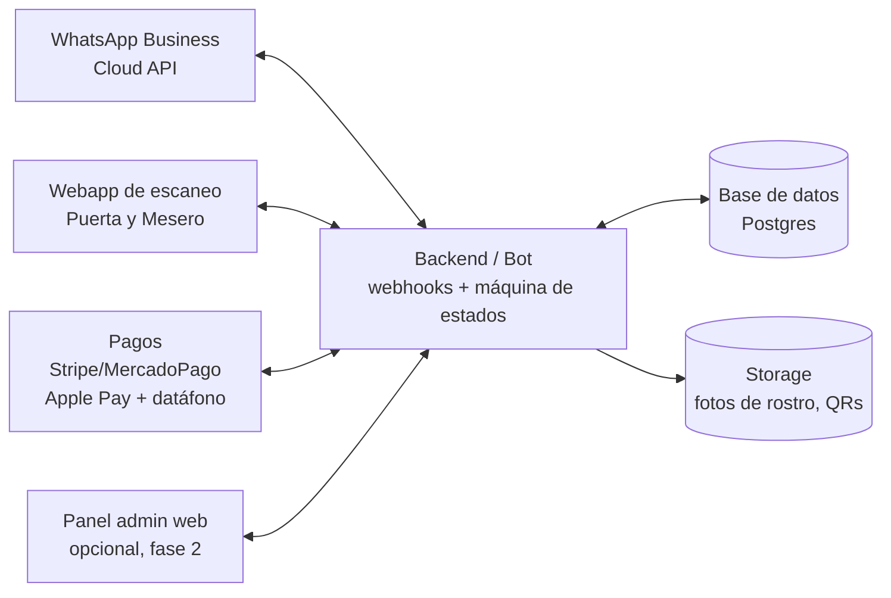

# Arquitectura técnica

## Vista general

### Piezas

1. **WhatsApp Business Cloud API (Meta)** — un solo número del negocio.
   - Mensajes interactivos: botones (máx. 3) y listas (máx. 10 opciones).
   - Plantillas aprobadas para iniciar conversaciones (alta de socio, invitación).
   - Recepción de media (foto del rostro) y envío de imágenes (QR).
   - El rol de cada persona se resuelve por su número de teléfono → la misma
     conversación muestra menús distintos según el perfil.

2. **Backend (bot + API)** — Node.js/TypeScript o Python.
   - Webhook de WhatsApp + **máquina de estados por conversación** (cada chat
     es un flujo: invitando, registrando, reportando...).
   - Genera QRs: token **JWT firmado y con versión** (revocable), no el
     teléfono en claro. Escanear un QR viejo tras una cancelación → inválido.
   - Reglas de negocio: restricciones de día/monto/personas/categorías.

3. **Base de datos (Postgres)** — entidades principales:
   - `usuarios` (teléfono, nombre, rol, estado, foto)
   - `invitaciones` (socio → invitado, restricciones, vigencia, estado)
   - `checkins` (invitado, puerta, hora, acompañantes)
   - `ordenes` / `orden_items` (mesero, invitado, productos, total, método de pago)
   - `productos` (catálogo del admin: nombre, precio, categoría)
   - `eventos` (opcional: fechas/aforos por evento)

4. **Webapp de escaneo (Puerta y Mesero)** — PWA que abre la cámara desde el
   navegador del teléfono; sin app nativa que instalar.
   - Puerta: escanear → foto + semáforo + acompañantes → check-in.
   - Mesero: escanear → foto + saldo/restricciones → orden → cobro.
   - Login por link mágico enviado a su WhatsApp (mismo número dado de alta).
   - *Por qué no 100% WhatsApp para el staff:* escanear QRs y capturar órdenes
     con rapidez necesita cámara y catálogo en pantalla; WhatsApp sirve como
     canal de alta y notificaciones, la operación va en la PWA.

5. **Pagos**
   - **Stripe** (Tap to Pay en iPhone = el teléfono del mesero ES el datáfono,
     y links de pago con Apple Pay/Google Pay) o **Mercado Pago** (Point) si el
     mercado es México/LATAM.
   - "A cuenta del socio": se acumula y se liquida al corte (tarjeta guardada
     del socio o facturación posterior).

6. **Storage** — S3/Supabase Storage para fotos de rostro y QRs, con acceso
   firmado (las fotos solo las ve el staff al escanear).

### Stack sugerido para arrancar rápido

- **Backend:** Node.js + TypeScript (Fastify/NestJS) o Supabase Edge Functions.
- **DB + Storage + Auth:** Supabase (Postgres + Storage + Realtime para que
  la puerta vea cancelaciones al instante).
- **PWA escaneo:** React/Next.js + `html5-qrcode`.
- **QR:** `qrcode` (generación) + JWT firmado con clave del servidor.
- **Pagos:** Stripe Tap to Pay / Payment Links, o Mercado Pago Point.
- **Detección de rostro en la selfie:** AWS Rekognition / API de visión, solo
  para validar que la foto tiene un rostro utilizable (no reconocimiento).

## Seguridad y privacidad

- QR = token firmado revocable; rotación si el invitado reenvía su QR a otro
  (la foto en pantalla del staff es la verdadera verificación de identidad).
- Fotos de rostro: datos personales sensibles → consentimiento explícito en el
  flujo de registro, acceso restringido, política de retención/borrado
  (relevante para LFPDPPP en México / GDPR).
- Auditoría: todo escaneo, alta, cancelación y cobro queda registrado con
  quién/cuándo.
- Números de staff con permiso solo de escanear: si se filtra el link de la
  PWA, sin sesión ligada a su WhatsApp no sirve.

## Fases propuestas

| Fase | Alcance |
|------|---------|
| **1 — MVP** | Alta de socios, invitación con restricciones, registro con foto, QR, check-in de puerta (PWA), reporte simple por WhatsApp |
| **2 — Consumo** | Catálogo, órdenes del mesero, validación de montos/categorías, cobro con link de pago y datáfono |
| **3 — Reportes y panel** | Panel web del admin, cortes de caja, PDF/Excel, autorizaciones en tiempo real al socio |
| **4 — Extras** | Multi-venue, eventos con aforo, membresías de pago, promociones por WhatsApp |

## Ideas adicionales

- **Autorización en vivo:** si el invitado excede su límite, el socio recibe un
  WhatsApp con [Autorizar $X] [Rechazar] en el momento.
- **Lista de llegadas:** el socio recibe "Ana acaba de entrar (con 2 personas)".
- **QR de un solo uso por día** que se refresca automáticamente cada mañana.
- **Modo evento:** el admin crea un evento con aforo y los socios reciben cupos.
- **Propinas** integradas en el link de pago.
- **Vetos compartidos:** lista negra del admin visible para todas las puertas.
- **Recordatorios:** "Tu invitación vence hoy a las 23:00".
- **Ranking de socios** por consumo generado (gamificación para el club).

## Preguntas abiertas (para afinar)

1. ¿México? (define Mercado Pago vs Stripe, y el marco legal de datos).
2. ¿Los acompañantes del invitado se registran también con foto, o entran
   "colgados" del QR del invitado principal?
3. ¿La cuenta del socio se liquida al momento, al corte del día, o mensual?
4. ¿Un solo venue o desde el inicio pensado multi-sede?
5. ¿El mesero cobra siempre al servir, o hay cuentas abiertas que se cierran
   al final de la noche?
6. ¿Cuántos socios/invitados esperan por noche? (dimensiona aforo y costos de
   WhatsApp API, que cobra por conversación).
