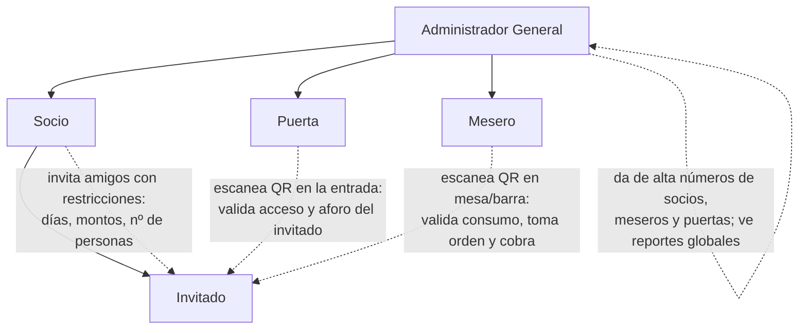

# Organigrama y roles

## Jerarquía

## Matriz de permisos

| Capacidad                                   | Admin | Socio | Puerta | Mesero | Invitado |
|---------------------------------------------|:-----:|:-----:|:------:|:------:|:--------:|
| Dar de alta socios (por número de teléfono)  | ✅    | ❌    | ❌     | ❌     | ❌       |
| Dar de alta meseros y puertas                | ✅    | ❌    | ❌     | ❌     | ❌       |
| Invitar amigos                               | ✅*   | ✅    | ❌     | ❌     | ❌       |
| Definir restricciones de invitación          | ✅    | ✅    | ❌     | ❌     | ❌       |
| Ver reporte propio (consumo de sus invitados)| ✅    | ✅    | ❌     | ❌     | ❌       |
| Ver reporte global                           | ✅    | ❌    | ❌     | ❌     | ❌       |
| Cancelar invitaciones                        | ✅    | ✅    | ❌     | ❌     | ❌       |
| Escanear QR de entrada                       | ✅    | ❌    | ✅     | ❌     | ❌       |
| Escanear QR de consumo / tomar orden         | ✅    | ❌    | ❌     | ✅     | ❌       |
| Cobrar (Apple Pay / datáfono ligado)         | ❌    | ❌    | ❌     | ✅     | ❌       |
| Recibir QR y presentarlo                     | ❌    | ❌    | ❌     | ❌     | ✅       |

\* El admin puede invitar directamente para eventos especiales (VIPs, prensa, etc.).

## Descripción de cada rol

### Administrador General
- Da de alta/baja socios, meseros y puertas por número de WhatsApp.
- Define políticas globales: horarios, aforo, catálogo de productos y precios,
  límites máximos que un socio puede otorgar.
- Recibe reportes: consumo por socio, por invitado, por día/evento, ranking,
  cortes de caja.
- Puede suspender a cualquier perfil al instante (ej. incidente en puerta).

### Socio
- Al ser dado de alta recibe mensaje de bienvenida con menú:
  **Invitar | Reporte | Cancelar**.
- Al invitar define restricciones (o deja abierto):
  - Días/fechas de acceso (ej. solo viernes, o solo el 15 de agosto).
  - Monto máximo de consumo (a cuenta del socio o del propio invitado).
  - Número de acompañantes permitidos.
  - Categorías permitidas (ej. solo bebidas, sin botellas, etc.).
- Es responsable (y visible en reportes) de lo que consumen sus invitados.

### Invitado
- Recibe la invitación por WhatsApp con las condiciones.
- Al aceptar: envía foto de su rostro → queda registrado → recibe su QR
  (ligado a su número de teléfono).
- Su QR es su identidad dentro del venue: entrada y consumo.
- No puede invitar a nadie (salvo que el socio le haya dado cupo de acompañantes,
  que entran junto con él en la puerta).

### Puerta
- Su interfaz es únicamente el escáner de QR (webapp ligera desde el mismo teléfono).
- Al escanear un QR de invitado ve: **foto del rostro**, nombre, socio que lo
  invitó, si tiene acceso hoy, y con cuántas personas puede entrar.
- Marca el ingreso (check-in) y el número real de acompañantes que entraron.
- Semáforo simple: 🟢 pasa / 🟡 revisar (restricción parcial) / 🔴 no pasa.

### Mesero
- Escanea el QR del invitado o socio antes de tomar la orden.
- Ve: foto, restricciones de consumo (monto disponible, categorías permitidas,
  o "abierto").
- Captura la orden en su teléfono (catálogo del admin) y cobra:
  - Apple Pay / Google Pay (link o tap-to-pay),
  - datáfono ligado al sistema,
  - o "a cuenta del socio" si la invitación lo permite.
- Cada consumo queda ligado al invitado → socio → reporte final.
