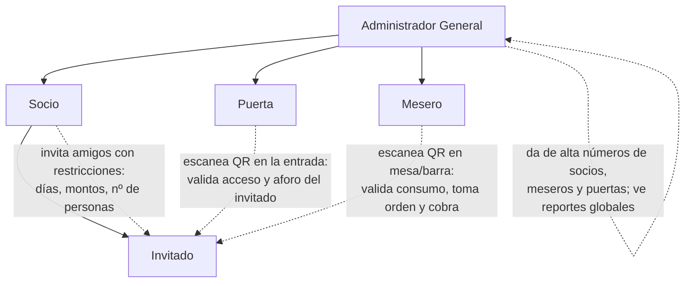

# Organigrama y roles

## Organigrama de navegación (quién ve qué app)

WhatsApp es la puerta de entrada a todo: cada persona recibe SU enlace y
aterriza ya dentro de su mundo. Nadie ve funciones que no son suyas.

```
🌐 PÚBLICO
   /              Landing → crear caseta / entrar (email o Google)
   /invitacion/   Registro del invitado (condiciones → selfie) → redirige a /mi/

📱 APP CLIENTE  /mi/?t=…   una sola app; pestañas según quién eres
   ├─ [Mi QR]    home = tu carnet (QR grande, caseta, tu estado)
   ├─ [Pedir]    carta → carrito → TU NÚMERO → "listo, recoge en barra"
   ├─ [Gastos]   socio: tú + cada invitado tuyo · invitado: su saldo
   └─ [Invitar]  solo socio: con barra (límite €) / solo entrada → WhatsApp
   · Socio: 4 pestañas · Invitado con barra: 3 · Invitado solo entrada: solo QR

🧑‍🍳 APP OPERACIÓN  (links mágicos, cero login)
   /camarero/    pedidos desde el móvil (Listo → Entregado) + comanda en barra
   /puerta/      escáner → foto + verde/rojo → registrar entrada

🖥️ PANEL DUEÑO  /panel/  (web; configura, no opera)
   Resumen · Socios (alta + "Su app") · Invitaciones (supervisa/cancela)
   · Equipo · Pantalla (link TV)

📺 TV  /tv/?t=…   pasiva: EN PREPARACIÓN | LISTOS
```

Cascada de distribución: dueño crea socio → WhatsApp → socio abre su app →
socio invita → WhatsApp → invitado se registra → su app. El staff recibe su
enlace y entra directo a su herramienta.

## Jerarquía



## Matriz de permisos

| Capacidad                                   | Admin | Socio | Puerta | Mesero | Invitado |
|---------------------------------------------|:-----:|:-----:|:------:|:------:|:--------:|
| Dar de alta socios (por número de teléfono)  | ✅    | ❌    | ❌     | ❌     | ❌       |
| Dar de alta meseros y puertas                | ✅    | ❌    | ❌     | ❌     | ❌       |
| Invitar amigos                               | ✅*   | ✅    | ❌     | ❌     | ❌       |
| Definir restricciones de invitación          | ✅    | ✅    | ❌     | ❌     | ❌       |
| Ver reporte propio (consumo de sus invitados)| ✅    | ✅    | ❌     | ❌     | ❌       |
| Ver reporte global                           | ✅    | ❌    | ❌     | ❌     | ❌       |
| Cancelar invitaciones                        | ✅    | ✅    | ❌     | ❌     | ❌       |
| Escanear QR de entrada                       | ✅    | ❌    | ✅     | ❌     | ❌       |
| Escanear QR de consumo / tomar orden         | ✅    | ❌    | ❌     | ✅     | ❌       |
| Registrar comanda y marcar "cobrado"         | ❌    | ❌    | ❌     | ✅     | ❌       |
| Recibir QR y presentarlo                     | ❌    | ❌    | ❌     | ❌     | ✅       |

\* El admin puede invitar directamente para eventos especiales (VIPs, prensa, etc.).

## Descripción de cada rol

### Administrador General
- Da de alta/baja socios, meseros y puertas por número de WhatsApp.
- Define políticas globales: horarios, aforo, catálogo de productos y precios,
  límites máximos que un socio puede otorgar.
- Recibe reportes: consumo por socio, por invitado, por día/evento, ranking,
  cortes de caja.
- Puede suspender a cualquier perfil al instante (ej. incidente en puerta).

### Socio
- Al ser dado de alta recibe mensaje de bienvenida con menú:
  **Invitar | Reporte | Cancelar**.
- Al invitar define restricciones (o deja abierto):
  - Días/fechas de acceso (ej. solo viernes, o solo el 15 de agosto).
  - Monto máximo de consumo (a cuenta del socio o del propio invitado).
  - Número de acompañantes permitidos.
  - Categorías permitidas (ej. solo bebidas, sin botellas, etc.).
- Es responsable (y visible en reportes) de lo que consumen sus invitados.

### Invitado
- Recibe la invitación por WhatsApp con las condiciones.
- Al aceptar: envía foto de su rostro → queda registrado → recibe su QR
  (ligado a su número de teléfono).
- Su QR es su identidad dentro del venue: entrada y consumo.
- No puede invitar a nadie. Sus acompañantes reciben cada uno su propia
  invitación por WhatsApp desde el sistema (dentro del cupo que dio el socio),
  se registran con su foto y entran con su propio QR.

### Puerta
- Su interfaz es únicamente el escáner de QR (webapp ligera desde el mismo teléfono).
- Al escanear un QR de invitado ve: **foto del rostro**, nombre, socio que lo
  invitó y si tiene acceso hoy. Cada acompañante trae su propio QR y se escanea
  igual, uno a uno.
- Marca el ingreso (check-in) de cada persona.
- Semáforo simple: 🟢 pasa / 🟡 revisar (restricción parcial) / 🔴 no pasa.

### Mesero
- Escanea el QR del socio o invitado antes de tomar la comanda.
- Ve: foto, restricciones de consumo (límite disponible, categorías permitidas,
  o "abierto").
- Captura la comanda en su teléfono (catálogo del admin), cobra con tarjeta en
  el **datáfono del local** al momento, y marca "cobrado" en el sistema.
- El sistema no procesa el pago: solo registra comanda, importe y estado.
- Cada consumo queda ligado al invitado → socio → reporte final.
